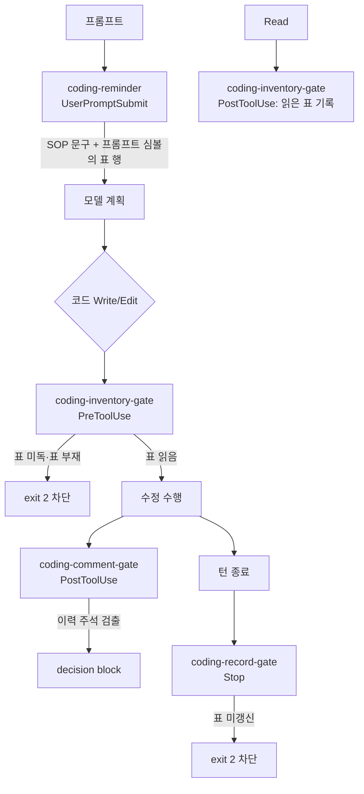

# coding 번들 훅 — 코드 리뷰 인벤토리

리뷰 대상: `coding/hooks/*.py` (4개) · 코드 버전: 워크트리 `session/4cd8ef59` 기준

## 1. 목적

coding 번들의 절차 규칙(`coding.md`)을 Claude Code 훅으로 강제하는 4개 실행기다.
규칙 문서가 선언한 것 중 **자기보고에 맡기면 지켜지지 않는 항목**만 골라 도구 호출
시점에 개입한다. 담당 분담은 §2 선독(reminder·inventory-gate), §6 갱신(record-gate),
§주석 규율(comment-gate).

## 2. 코드 플로우차트

## 3. 함수 리스트 표

| # | 함수 | 입력 | 출력 | 기능 | 위치(file:line) |
|---|---|---|---|---|---|
| 1 | `rule_active` | `cwd` | `bool` | 활성화 게이트 — `docs/claude_guideline/coding/coding.md` 존재 여부 | coding-inventory-gate.py:76 |
| 2 | `_git` | `cwd,*args` | `str\|None` | git 1줄 출력. **개행만** 제거(공백으로 끝나는 폴더명 보존) | coding-inventory-gate.py:81 |
| 3 | `repo_top` | `cwd` | `str\|None` | 저장소 최상위(realpath) | coding-inventory-gate.py:96 |
| 4 | `state_root` | `cwd` | `str` | 상태 저장소. git 이면 `.git/coding`, 아니면 `.claude/coding` | coding-inventory-gate.py:101 |
| 5 | `reads_dir` / `reads_path` / `allow_path` | `root[,sid]` | `str` | 세션별 읽음 목록·allow 파일 경로 | coding-inventory-gate.py:112 |
| 6 | `read_lines` | `path` | `list[str]` | 목록 파일을 줄 단위로. 없으면 빈 리스트 | coding-inventory-gate.py:124 |
| 7 | `rel_to` | `base,path` | `str\|None` | base 기준 상대경로. base 밖이면 None | coding-inventory-gate.py:132 |
| 8 | `_owner_of` | `dirpath` | `str\|None` | 표 디렉터리를 소유한 모듈 디렉터리 | coding-inventory-gate.py:140 |
| 9 | `tables_by_owner` | `base` | `dict` | 소유 모듈 → 표 목록. `claude_guideline` 하위 제외 | coding-inventory-gate.py:150 |
| 10 | `_anchor` | `name` | `Pattern` | `파일명:줄` 앵커. 좌측 경계로 부분문자열 오탐 차단 | coding-inventory-gate.py:174 |
| 11 | `_row_score` | `row,payload` | `int` | 행 식별자 중 payload 에 **단어 경계** 일치하는 수. 표 행 +1 우대 | coding-inventory-gate.py:185 |
| 12 | `table_rows` | `base,target_rel,tables,payload` | `list[str]` | 대상이 등재된 행을 관련도순으로 | coding-inventory-gate.py:203 |
| 13 | `edit_payload` | `tool_input` | `str` | 수정 내용(old/new_string·content·edits) 합본 | coding-inventory-gate.py:236 |
| 14 | `covering_tables` | `base,target_rel` | `list[str]` | **최근접 조상 모듈**의 표만, 앵커 필수 | coding-inventory-gate.py:250 |
| 15 | `track_read` | `data,cwd,root` | None | 읽은 파일을 세션 목록에 dedup 누적 | coding-inventory-gate.py:277 |
| 16 | `gate_write` | `data,cwd,root` | `int` | 표 미독·부재 시 exit 2. 표 행 동봉 | coding-inventory-gate.py:294 |
| 17 | `main` | — | `int` | 이벤트 분기(PostToolUse Read / PreToolUse 수정) | coding-inventory-gate.py:345 |
| 20 | `load_gate` | — | `module\|None` | 게이트 모듈 재사용(표 탐색 로직 1곳 유지) | coding-reminder.py:57 |
| 21 | `table_hits` | `g,cwd,prompt` | `list[tuple]` | 프롬프트 심볼을 표에서 조회 → (점수,표,행) 상위 | coding-reminder.py:74 |
| 22 | `main` | — | None | 트리거 감지 → SOP 주입 + 표 행 주입 | coding-reminder.py:102 |
| 30 | `load_gate` | — | `module\|None` | 게이트 모듈 재사용 | coding-record-gate.py:34 |
| 31 | `turn_edits` | `transcript_path` | `list[str]` | 이번 턴의 Edit/Write 대상. 실패 호출 제외 | coding-record-gate.py:51 |
| 32 | `main` | — | `int` | 고친 코드의 커버 표를 같은 턴에 고쳤는지 확인 | coding-record-gate.py:104 |
| 40 | `rule_active` | `cwd` | `bool` | 활성화 게이트 | coding-comment-gate.py:56 |
| 41 | `is_code_file` | `path` | `bool` | 코드 확장자 + skip 경로 제외(`/hooks/`·`/tests/`·`/checks/`) | coding-comment-gate.py:61 |
| 42 | `added_texts` | `tool_name,tool_input` | `list[str]` | 이번 호출이 **추가한** 텍스트만 | coding-comment-gate.py:69 |
| 43 | `scan` | `text` | `list[tuple]` | 주석 구간의 이력 패턴 검출 | coding-comment-gate.py:79 |
| 44 | `main` | — | `int` | 검출 시 `{"decision":"block"}` | coding-comment-gate.py:94 |
| 50 | `rule_active` | `cwd` | `bool` | 활성화 게이트 + ros2 도메인 설치 확인 | coding-ros2-qos.py:44 |
| 51 | `added_texts` | `tool_name,tool_input` | `list[str]` | 이번 호출이 추가한 텍스트 | coding-ros2-qos.py:56 |
| 52 | `find_endpoints` | `text` | `list[tuple]` | 추가분에서 pub/sub 생성 호출 검출 | coding-ros2-qos.py:66 |
| 53 | `main` | — | `int` | 검출 시 QoS 결정·토픽 표 등재 안내 출력(비차단) | coding-ros2-qos.py:80 |

### 3-1. 계약 테스트 (tests/)

훅은 사용자 작업을 차단하므로 테스트 없이 출하하지 않는다(coding.md §변경 절차).
각 테스트는 stdin JSON → exit code·출력 계약을 검증하는 bash 하네스다.

| # | 함수 | 입력 | 출력 | 기능 | 위치(file:line) |
|---|---|---|---|---|---|
| 50 | `setup` / `teardown` | — | — | 실사격 구조를 본뜬 fixture 생성·제거 | inventory-gate.test.sh:30 |
| 51 | `hook` | `event,tool,rel,sid[,payload]` | `RC` | 훅 호출. 인터프리터 오류를 차단 신호와 구분 | inventory-gate.test.sh:112 |
| 52 | `check` / `has` / `hasnt` | `이름,기대,실제` | — | 단언 3종 | inventory-gate.test.sh:125 |
| 60 | `setup` / `teardown` | — | — | 규칙 활성 + 표 fixture | reminder-inject.test.sh:27 |
| 61 | `ask` | `프롬프트` | `RC` | UserPromptSubmit 주입 호출 | reminder-inject.test.sh:56 |
| 70 | `setup` / `teardown` | — | — | 표·code_updates 포함 fixture | record-gate.test.sh:25 |
| 71 | `tr_reset` / `tr_add` | `tool,rel` | — | 가짜 transcript(JSONL) 작성 | record-gate.test.sh:47 |
| 72 | `stop` | `[stop_hook_active]` | `RC` | Stop 훅 호출 | record-gate.test.sh:62 |
| 80 | `setup` / `teardown` | — | — | 규칙 활성 fixture | comment-gate.test.sh:22 |
| 81 | `edit` | `rel,new_string` | `RC` | PostToolUse 호출 | comment-gate.test.sh:31 |
| 82 | `blocked` | `이름,yes\|no` | — | `decision:block` 유무 단언 | comment-gate.test.sh:41 |

## 4. 전역 변수 / 모듈 상수 표

| # | 변수 | 사용처(함수) | 기능 | 위치(file:line) |
|---|---|---|---|---|
| 1 | `GATE_TOOLS` (상수) | `main` | PreToolUse 차단 대상 도구 | coding-inventory-gate.py:35 |
| 2 | `READ_TOOLS` (상수) | `main` | 읽음 기록 대상 도구 | coding-inventory-gate.py:36 |
| 3 | `CODE_EXT` (상수) | `gate_write`·`main` | 코드 확장자. `.ino`·`.pde` 포함 | coding-inventory-gate.py:38 |
| 4 | `SKIP_DIRS` (상수) | `tables_by_owner` | 스캔 제외 디렉터리. `.pio` 포함 | coding-inventory-gate.py:47 |
| 5 | `MAX_CANDIDATES` (상수) | `tables_by_owner` | 표 후보 스캔 상한 400 | coding-inventory-gate.py:53 |
| 6 | `MAX_TABLE_BYTES` (상수) | `covering_tables`·`table_rows` | 표 1개 읽기 상한 512KB | coding-inventory-gate.py:54 |
| 7 | `MAX_ROWS` / `MAX_ROW_CHARS` (상수) | `gate_write` | 동봉 행 수·길이 상한 8 / 240 | coding-inventory-gate.py:55 |
| 8 | `ROW_TOKEN` / `IDENT` / `STOPWORDS` (상수) | `_row_score` | 행 식별자 추출·제외어 | coding-inventory-gate.py:180 |
| 9 | `TRIGGERS` (상수) | `main` | 코드 작업 트리거 키워드 | coding-reminder.py:28 |
| 10 | `RULE_MD` (상수) | `main` | 활성화 게이트 경로 | coding-reminder.py:36 |
| 11 | `DIRECTIVE` (상수) | `main` | 주입할 SOP 문구 | coding-reminder.py:38 |
| 12 | `MAX_HITS` (상수) | `table_hits` | 주입 행 수 상한 6 | coding-reminder.py:25 |
| 13 | `MAX_SHOWN` / `EDIT_TOOLS` (상수) | `main`·`turn_edits` | 경보 나열 상한 5 / 수정 도구 | coding-record-gate.py:28 |
| 14 | `CODE_EXTS` / `SKIP_PATH_PARTS` (상수) | `is_code_file` | 검사 대상·제외 경로 | coding-comment-gate.py:31 |
| 15 | `COMMENT_MARKER` / `PATTERNS` / `WHITELIST` (상수) | `scan` | 주석 마커·이력 패턴·예외 | coding-comment-gate.py:46 |

## 5. 의존성 3-tier 표

| Tier | 대상 | 버전/제약 | 부재 시 동작(필수/선택) | 근거(파일:line) |
|---|---|---|---|---|
| 빌드 | 없음 (표준 라이브러리만) | — | — | 각 훅 import 절 |
| 런타임 필수 | `python3` | 3.6+ | 훅 미등록과 동일 — 강제력 0 | install.sh PYBIN 탐색 |
| 런타임 필수 | Claude Code 훅 계약 | PreToolUse/PostToolUse/Stop | 타 에이전트에서는 강제력 0 | coding.md §0 |
| 런타임 선택 | `git` | — | 비-git 프로젝트는 `.claude/coding` fallback | coding-inventory-gate.py:101 |
